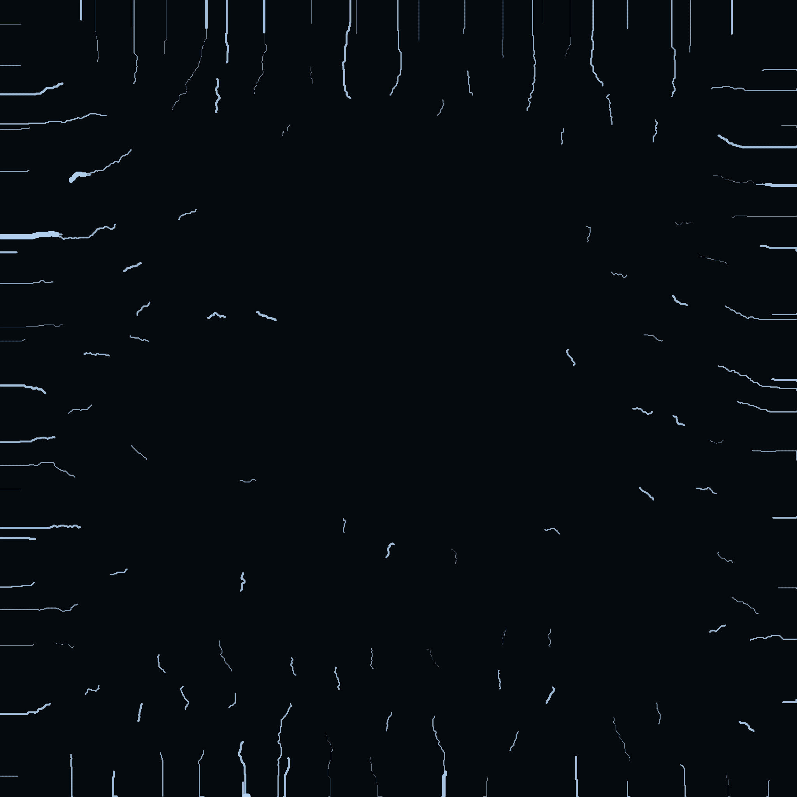
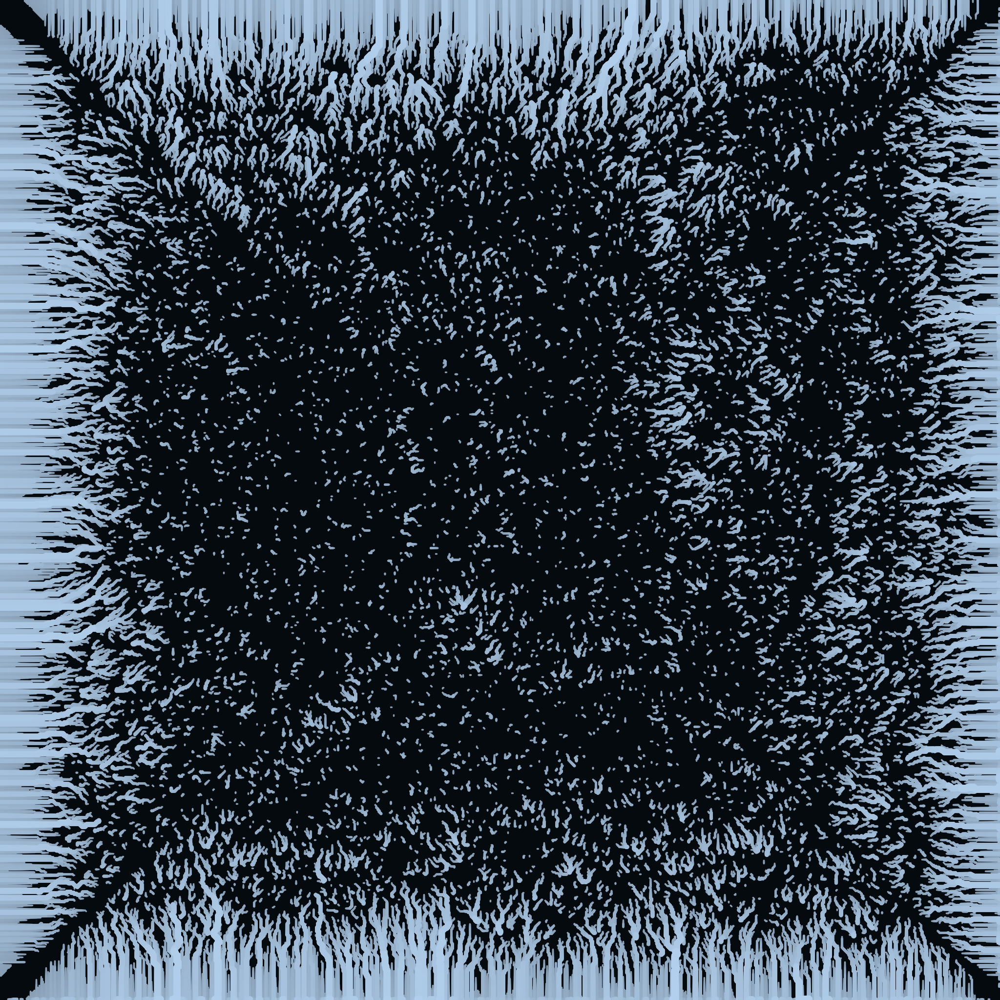

# Procedural River Network Generator

A beautiful procedural river network visualization inspired by watershed maps, written in Rust with GPU-accelerated rendering. Features particle-based hydraulic erosion for realistic river formation.

Based on [Nick McDonald's Procedural Hydrology](https://nickmcd.me/2020/04/15/procedural-hydrology/).


## Sample Outputs

| Seed 42 | Seed 1337 | Seed 2024 |
|---------|-----------|-----------|
|  |  |  |

## Features

- **Particle-Based Hydraulic Erosion**: Water droplets move across terrain, eroding and depositing sediment to form realistic river networks
- **Discharge & Momentum Tracking**: Cumulative water flow creates natural river paths that attract more water
- **Procedural Terrain Generation**: Multi-octave noise-based heightmap generation with realistic drainage patterns
- **Dual Simulation Modes**: Toggle between particle erosion and D8 flow direction algorithms
- **Sediment Transport**: Particles erode terrain based on slope and deposit when slowing down
- **Hydrology Simulation**: D8 flow direction algorithm with flow accumulation calculation
- **Watershed Delineation**: Automatic identification and coloring of distinct watersheds/drainage basins
- **Stream Order Calculation**: Strahler stream ordering for realistic river hierarchy
- **GPU-Accelerated Rendering**: wgpu-based rendering with custom WGSL shaders
- **Beautiful Visualization**: Color-coded watersheds with glow effects and smooth animations
- **Interactive Controls**: Pan, zoom, and regenerate terrain in real-time

## Controls

| Key/Action | Description |
|------------|-------------|
| Mouse Drag | Pan the view |
| Mouse Wheel | Zoom in/out |
| Space | Generate new random terrain |
| R | Reset view to default |
| +/- | Adjust river detail (flow threshold) |
| E | Toggle erosion mode (particle-based vs D8) |
| [/] | Decrease/increase erosion iterations |
| S/A | Increase/decrease terrain size |
| Escape | Quit |

## Building

### Prerequisites

- Rust 1.70 or later
- A GPU with Vulkan, Metal, or DX12 support

### Build & Run

```bash
# Clone the repository
git clone https://github.com/your-username/river-procedural-network.git
cd river-procedural-network

# Build in release mode (recommended for performance)
cargo build --release

# Run interactive GUI (requires display)
cargo run --release

# Generate PNG images (headless, no GPU required)
cargo run --release --bin generate-images
```

### Generate Images (Headless)

The `generate-images` binary creates beautiful PNG renders without requiring a GPU or display:

```bash
cargo run --release --bin generate-images
```

This generates multiple sample images in the `images/` directory.

## Technical Details

### Terrain Generation

The terrain is generated using multiple layers of Fractal Brownian Motion (fBm) noise:
- Base terrain layer with 8 octaves
- Ridge mountains using absolute value transformation
- Valley carving using squared noise values
- Edge falloff for island-like appearance

### Hydrology Simulation

The simulation supports two modes:

#### Particle-Based Erosion (Default)
Based on [Nick McDonald's Procedural Hydrology](https://nickmcd.me/2020/04/15/procedural-hydrology/):
1. **Particle Spawning**: Water droplets spawn at random positions on the terrain
2. **Gravity-Driven Movement**: Particles move downhill following terrain gradients with momentum
3. **Erosion & Deposition**: Particles erode terrain when moving fast, deposit when slowing down
4. **Discharge Tracking**: Cumulative water flow accumulates in discharge and momentum maps
5. **River Formation**: High-discharge areas naturally form river channels through erosion
6. **Evaporation**: Particles lose volume over time and eventually die

#### D8 Flow Direction (Alternative)
Classic grid-based approach:
1. **D8 Flow Direction**: Each cell flows to its steepest downhill neighbor
2. **Flow Accumulation**: Topological sort-based upstream area calculation
3. **Watershed Delineation**: Tracing from pour points to identify distinct basins
4. **Stream Order**: Strahler ordering system for river hierarchy

### Rendering

- Custom WGSL shaders for river visualization
- Per-watershed color palette for distinct basin identification
- Flow-based line thickness for visual hierarchy
- Subtle glow effects for major rivers
- Dark atmospheric background with terrain hints

## Architecture

```
src/
├── main.rs             # Interactive GUI application
├── generate_images.rs  # Headless PNG image generator
├── terrain.rs          # Procedural terrain generation
├── hydrology.rs        # Flow direction, accumulation, and watershed analysis
├── particle.rs         # Particle-based hydraulic erosion simulation
├── renderer.rs         # wgpu GPU rendering pipeline
├── lib.rs              # Library exports
└── shaders/
    ├── river.wgsl      # River rendering shader
    └── background.wgsl # Background rendering shader
images/
├── hero.png            # Main showcase image
└── river_network_*.png # Sample outputs with different seeds
```

## Dependencies

- `wgpu` - GPU rendering
- `winit` - Windowing
- `noise` - Procedural noise generation
- `bytemuck` - Safe transmutation
- `rayon` - Parallel processing (for future optimizations)
- `rand` - Random number generation

## License

MIT License - feel free to use this for any purpose.

## Acknowledgments

Inspired by beautiful watershed visualization maps like those created by Grasshopper Geography.
